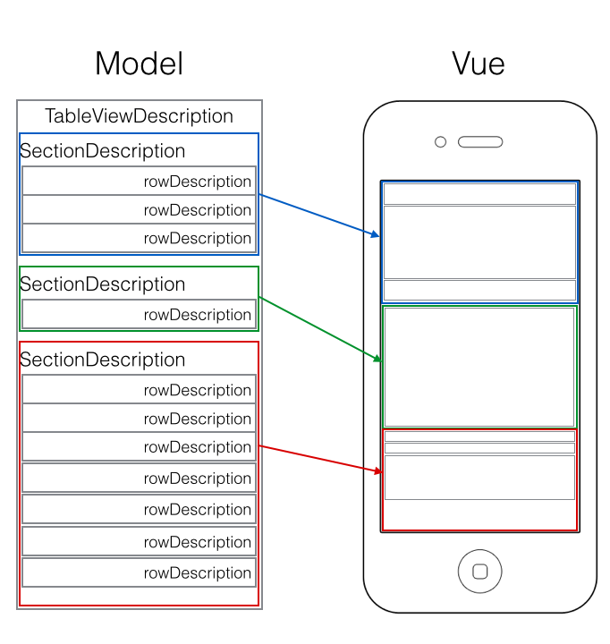

Purpose
--------------
JMOTableViewDescription is an Objective-C library for easily creating and manage complex structured tableView.



Why this project?
* TableView protocols are simple but not adapted to manipulate heterogenous objets or cells in your TableView.
* Some situations can lead to very complicated algorithms to construct the right TableViewCell to present a particular object.
* SectionHeaderView not reusable?

This project present:
* A new way to describe your tableView "layout" with a very simple method (a model),
* Datasource / Delegate considerably simplified by using this model,
* It's a very simple way to produce a "grouped tableView" style without having to use grouped stype!
* The code produced using this implementation his highly customizable, reusable and flexible. (No more bugs?)
* TableView delegate and datasource focus on manipulated objet, no indexPath!, 
* HeaderView reuse ? Replace your header by a cell, your first row :) 

Supported iOS & SDK Versions
-----------------------------

* Supported build target - iOS 7.1 (Xcode 5.1)
* Earliest supported deployment target - iOS 5.0
* Earliest compatible deployment target - iOS 5.0

NOTE: 'Supported' means that the library has been tested with this version. 'Compatible' means that the library should work on this iOS version (i.e. it doesn't rely on any unavailable SDK features) but is no longer being tested for compatibility and may require tweaking or bug fixes to run correctly.


TableViewDescription methods making the life easier
------------------
```objc
- (void)registerCellClassesIntoTableView:(UITableView *)tableView;
```
Auto register your classes into your tableView.
You can implement a similar methods to register your nibs in your tableView (no more dequeReusableCell problems).

```objc
- (void)reloadDataFromDescription:(JMOTableViewDescription *)fromDescription 
                    toDescription:(JMOTableViewDescription *)toDescription animated:(BOOL)animated;
```
A full dynamic way to reload of your tableView to animated cell modification.
It's a better UI effect than a reloadData.

TableViewDatasource / Delegate simplicty ?
------------------
```objc
- (NSInteger)numberOfSectionsInTableView:(UITableView *)tableView
{
    return self.tableViewDescription.sectionsDescription.count;
}

- (NSInteger)tableView:(UITableView *)tableView numberOfRowsInSection:(NSInteger)section
{
    JMOTableViewSectionDescription *tableSection = self.tableViewDescription.sectionsDescription[section];
    return tableSection.rowDescriptions.count;
}

- (CGFloat)tableView:(UITableView *)tableView heightForRowAtIndexPath:(NSIndexPath *)indexPath
{
    JMOTableViewRowDescription *rowDesc = [self.tableViewDescription rowDescriptionForIndexPath:indexPath];
    return rowDesc.cellHeight;
}

- (CGFloat)tableView:(UITableView *)tableView heightForHeaderInSection:(NSInteger)section
{
    JMOTableViewSectionDescription *sectionDesc = [self.tableViewDescription sectionDescriptionForSection:section];
    return sectionDesc.sectionHeight;
}
```

TableViewDescription exemple
------------------
Subclass the default JMOTableViewDescription and declare your method to generate your custom TableViewDescription.
```objc
@interface JMODemoTableViewDescription : JMOTableViewDescription
+ (JMODemoTableViewDescription *)descriptionNumber:(NSInteger)number;
@end
```

```objc
@implementation JMODemoTableViewDescription
+ (JMODemoTableViewDescription *)descriptionNumber:(NSInteger)number
{
  //Declare your TableView description
  JMODemoTableViewDescription *desc = [JMODemoTableViewDescription new];

  //Declare your first section description
  JMOTableViewSectionDescription *oneSection = [JMOTableViewSectionDescription new];
  oneSection.sectionHeight = 0.0f;

  //Declare your rows descriptions
  JMOTableViewRowDescription *oneRow = [JMOTableViewRowDescription new];
  oneRow.cellClass = [UITableViewCell class];
  oneRow.cellHeight = 30.0f;
  oneRow.cellReuseIdentifier = @"UITableViewCellIdentifier";
  oneRow.data = @"My first cell";
  //add your row description to your section
  [oneSection addRowDescription:oneRow];

  oneRow = [JMOTableViewRowDescription new];
  oneRow.cellClass = [JMOTableViewCellBlue class];
  oneRow.cellHeight = 44.0f;
  oneRow.cellReuseIdentifier = @"JMOTableViewCellBlue";
  oneRow.data = [NSString stringWithFormat:@"%@ (%d)",oneRow.cellReuseIdentifier,(int)oneRow.cellHeight];
  //add your row description to your section
  [oneSection addRowDescription:oneRow];

  //add one optional row??
  if(number == 2) {
      oneRow = [JMOTableViewRowDescription new];
      oneRow.cellClass = [JMOTableViewCellRed class];
      oneRow.cellHeight = 44.0f;
      oneRow.cellReuseIdentifier = @"JMOTableViewCellRed";
      oneRow.data = [NSString stringWithFormat:@"%@ (%d)",oneRow.cellReuseIdentifier,(int)oneRow.cellHeight];
      //add your optional row description to your section
      [oneSection addRowDescription:oneRow];
  }

  oneRow = [JMOTableViewRowDescription new];
  oneRow.cellClass = [JMOTableViewCellRed class];
  oneRow.cellHeight = 44.0f;
  oneRow.cellReuseIdentifier = @"JMOTableViewCellRed";
  oneRow.data = [NSString stringWithFormat:@"%@ (%d)",oneRow.cellReuseIdentifier,(int)oneRow.cellHeight];
  //add your row description to your section
  [oneSection addRowDescription:oneRow];

  //add your section description to your tableView decription
  [desc.sectionsDescription addObject:secondSection];
}
@end
```

------------------

Versions
------------------

- Initial release
